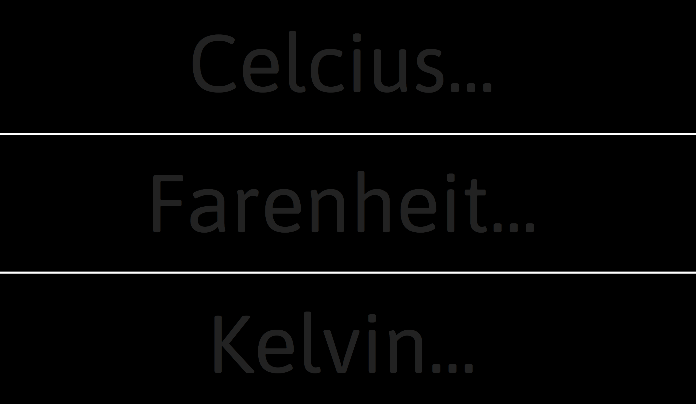

The Temperature-Converter

The temperature-converter allows users to convert Fahrenheit to Celsius or Kelvin or any which way users desire. When a temperature is inserted into an input the other two selections dynamically convert based on what the user inputs.  

The temperature-converter was built in vanilla JavaScript and uses CSS and HTML.

The app is ready to make some conversions. Temperature-Converter can be found at https://temperature-converter-88dda.firebaseapp.com/ 

This app was created by Nicholas Munson before any formal training in web development. 

